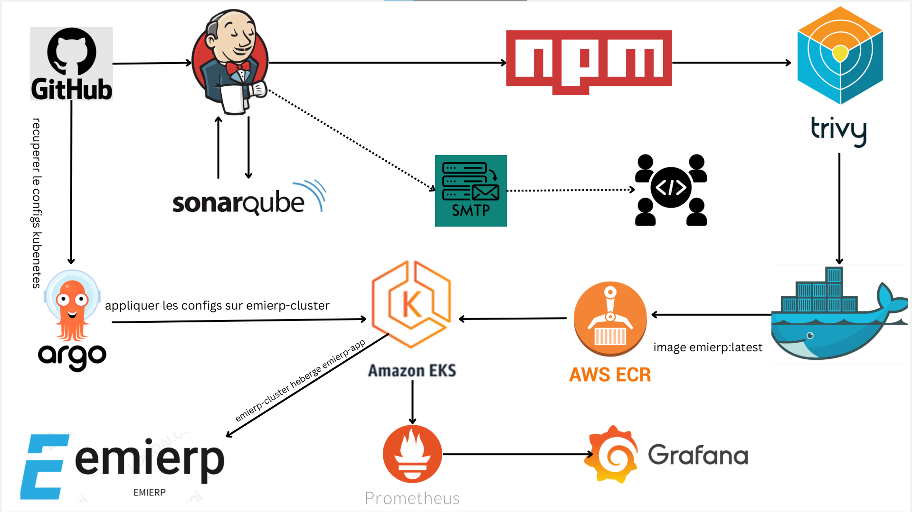

# emierp Clone Deployment Project


## Project Overview
This project demonstrates deploying an emierp clone using a set of DevOps tools and practices. The primary tools include:

- **Terraform**: Infrastructure as Code (IaC) tool to create AWS infrastructure such as EC2 instances and EKS clusters.
- **GitHub**: Source code management.
- **Jenkins**: CI/CD automation tool.
- **SonarQube**: Code quality analysis and quality gate tool.
- **NPM**: Build tool for NodeJS.
- **Aqua Trivy**: Security vulnerability scanner.
- **Docker**: Containerization tool to create images.
- **AWS ECR**: Repository to store Docker images.
- **AWS EKS**: Container management platform.
- **ArgoCD**: Continuous deployment tool.
- **Prometheus & Grafana**: Monitoring and alerting tools.

## Pre-requisites
1. **AWS Account**: Ensure you have an AWS account. [Create an AWS Account](https://docs.aws.amazon.com/accounts/latest/reference/manage-acct-creating.html)
2. **AWS CLI**: Install AWS CLI on your local machine. [AWS CLI Installation Guide](https://docs.aws.amazon.com/cli/latest/userguide/getting-started-install.html)
4. **Install Terraform in Windows**: Download and install Terraform in Windows [Terraform in Windows](https://learn.microsoft.com/en-us/azure/developer/terraform/get-started-windows-bash)

## Configuration
### AWS Setup
1. **IAM User**: Create an IAM user and generate the access and secret keys to configure your machine with AWS.
2. **Key Pair**: Create a key pair named `key` for accessing your EC2 instances.

## Infrastructure Setup Using Terraform
1. **Clone the Repository** (Open Command Prompt & run below):
   ```bash
   git clone https://github.com/ibrahimimohamed2108/erp-clone.git
   cd erp-clone
   code .   # this command will open VS code in backend
   ```
2. **Initialize and Apply Terraform**:

   - Open `terraform_code/ec2_server/main.tf` in VS Code.
   - Run the following commands:
     ```bash
     aws configure
     terraform init
     terraform apply --auto-approve
     ```

This will create the EC2 instance, security groups, and install necessary tools like Jenkins, Docker, SonarQube, etc.

## SonarQube Configuration
1. **Login Credentials**: Use `admin` for both username and password.
2. **Generate SonarQube Token**:
   - Create a token under `Administration → Security → Users → Tokens`.
   - Save the token for integration with Jenkins.

## Jenkins Configuration
1. **Add Jenkins Credentials**:
   - Add the SonarQube token, AWS access key, and secret key in `Manage Jenkins → Credentials → System → Global credentials`.
2. **Install Required Plugins**:
   - Install plugins such as SonarQube Scanner, NodeJS, Docker, and Prometheus metrics under `Manage Jenkins → Plugins`.

3. **Global Tool Configuration**:
   - Set up tools like JDK 17, SonarQube Scanner, NodeJS, and Docker under `Manage Jenkins → Global Tool Configuration`.

## Pipeline Overview
### Pipeline Stages
1. **Git Checkout**: Clones the source code from GitHub.
2. **SonarQube Analysis**: Performs static code analysis.
3. **Quality Gate**: Ensures code quality standards.
4. **Install NPM Dependencies**: Installs NodeJS packages.
5. **Trivy Security Scan**: Scans the project for vulnerabilities.
6. **Docker Build**: Builds a Docker image for the project.
7. **Push to AWS ECR**: Tags and pushes the Docker image to ECR.
8. **Image Cleanup**: Deletes images from the Jenkins server to save space.

### Running Jenkins Pipeline
Create and run the build pipeline in Jenkins. The pipeline will build, analyze, and push the project Docker image to ECR.
Create a Jenkins pipeline by adding the following script:

### Build Pipeline

```groovy
pipeline {
    agent any
    
    parameters {
        string(name: 'ECR_REPO_NAME', defaultValue: 'emierp', description: 'Enter repository name')
        string(name: 'AWS_ACCOUNT_ID', defaultValue: '409556542010', description: 'Enter AWS Account ID') // Added missing quote
    }
    
    tools {
        jdk 'JDK'
        nodejs 'NodeJS'
    }
    
    environment {
        SCANNER_HOME = tool 'SonarQube Scanner'
    }
    
    stages {
        stage('1. Git Checkout') {
            steps {
                git branch: 'main', url: 'https://github.com/ibrahimimohamed2108/erp-clone.git'
            }
        }
        
        stage('2. SonarQube Analysis') {
            steps {
                withSonarQubeEnv ('sonar-server') {
                    sh """
                    $SCANNER_HOME/bin/sonar-scanner \
                    -Dsonar.projectName=emierp \
                    -Dsonar.projectKey=emierp
                    """
                }
            }
        }
        
        stage('3. Quality Gate') {
            steps {
                waitForQualityGate abortPipeline: false, 
                credentialsId: 'sonar-token'
            }
        }
        
        stage('4. Install npm') {
            steps {
                sh "npm install"
            }
        }
        
        stage('5. Trivy Scan') {
            steps {
                sh "trivy fs . > trivy.txt"
            }
        }
        
        stage('6. Build Docker Image') {
            steps {
                sh "docker build -t ${params.ECR_REPO_NAME} ."
            }
        }
        
        stage('7. Create ECR repo') {
            steps {
                withCredentials([string(credentialsId: 'access-key', variable: 'AWS_ACCESS_KEY'), 
                                 string(credentialsId: 'secret-key', variable: 'AWS_SECRET_KEY')]) {
                    sh """
                    aws configure set aws_access_key_id $AWS_ACCESS_KEY
                    aws configure set aws_secret_access_key $AWS_SECRET_KEY
                    aws ecr describe-repositories --repository-names ${params.ECR_REPO_NAME} --region us-east-1 || \
                    aws ecr create-repository --repository-name ${params.ECR_REPO_NAME} --region us-east-1
                    """
                }
            }
        }
        
        stage('8. Login to ECR & tag image') {
            steps {
                withCredentials([string(credentialsId: 'access-key', variable: 'AWS_ACCESS_KEY'), 
                                 string(credentialsId: 'secret-key', variable: 'AWS_SECRET_KEY')]) {
                    sh """
                    aws ecr get-login-password --region us-east-1 | docker login --username AWS --password-stdin ${params.AWS_ACCOUNT_ID}.dkr.ecr.us-east-1.amazonaws.com
                    docker tag ${params.ECR_REPO_NAME} ${params.AWS_ACCOUNT_ID}.dkr.ecr.us-east-1.amazonaws.com/${params.ECR_REPO_NAME}:${BUILD_NUMBER}
                    docker tag ${params.ECR_REPO_NAME} ${params.AWS_ACCOUNT_ID}.dkr.ecr.us-east-1.amazonaws.com/${params.ECR_REPO_NAME}:latest
                    """
                }
            }
        }
        
        stage('9. Push image to ECR') {
            steps {
                withCredentials([string(credentialsId: 'access-key', variable: 'AWS_ACCESS_KEY'), 
                                 string(credentialsId: 'secret-key', variable: 'AWS_SECRET_KEY')]) {
                    sh """
                    docker push ${params.AWS_ACCOUNT_ID}.dkr.ecr.us-east-1.amazonaws.com/${params.ECR_REPO_NAME}:${BUILD_NUMBER}
                    docker push ${params.AWS_ACCOUNT_ID}.dkr.ecr.us-east-1.amazonaws.com/${params.ECR_REPO_NAME}:latest
                    """
                }
            }
        }
        
        stage('10. Cleanup Images') {
            steps {
                sh """
                docker rmi ${params.AWS_ACCOUNT_ID}.dkr.ecr.us-east-1.amazonaws.com/${params.ECR_REPO_NAME}:${BUILD_NUMBER}
                docker rmi ${params.AWS_ACCOUNT_ID}.dkr.ecr.us-east-1.amazonaws.com/${params.ECR_REPO_NAME}:latest
		docker images
                """
            }
        }
    }
}
```

## Continuous Deployment with ArgoCD
1. **Create EKS Cluster**: Use Terraform to create an EKS cluster and related resources.
2. **Deploy emierp Clone**: Use ArgoCD to deploy the application using Kubernetes YAML files.
3. **Monitoring Setup**: Install Prometheus and Grafana using Helm charts for monitoring the Kubernetes cluster.

### Deployment Pipeline
```groovy
pipeline {
    agent any

    environment {
        KUBECTL = '/usr/local/bin/kubectl'
    }

    parameters {
        string(name: 'CLUSTER_NAME', defaultValue: 'emierp-cluster', description: 'Enter your EKS cluster name')
    }

    stages {
        stage("Login to EKS") {
            steps {
                script {
                    withCredentials([string(credentialsId: 'access-key', variable: 'AWS_ACCESS_KEY'),
                                     string(credentialsId: 'secret-key', variable: 'AWS_SECRET_KEY')]) {
                        sh "aws eks --region us-east-1 update-kubeconfig --name ${params.CLUSTER_NAME}"
                    }
                }
            }
        }

        stage("Configure Prometheus & Grafana") {
            steps {
                script {
                    sh """
                    helm repo add stable https://charts.helm.sh/stable || true
                    helm repo add prometheus-community https://prometheus-community.github.io/helm-charts || true
                    # Check if namespace 'prometheus' exists
                    if kubectl get namespace prometheus > /dev/null 2>&1; then
                        # If namespace exists, upgrade the Helm release
                        helm upgrade stable prometheus-community/kube-prometheus-stack -n prometheus
                    else
                        # If namespace does not exist, create it and install Helm release
                        kubectl create namespace prometheus
                        helm install stable prometheus-community/kube-prometheus-stack -n prometheus
                    fi
                    kubectl patch svc stable-kube-prometheus-sta-prometheus -n prometheus -p '{"spec": {"type": "LoadBalancer"}}'
                    kubectl patch svc stable-grafana -n prometheus -p '{"spec": {"type": "LoadBalancer"}}'
                    """
                }
            }
        }

        stage("Configure ArgoCD") {
            steps {
                script {
                    sh """
                    # Install ArgoCD
                    kubectl create namespace argocd || true
                    kubectl apply -n argocd -f https://raw.githubusercontent.com/argoproj/argo-cd/stable/manifests/install.yaml
                    kubectl patch svc argocd-server -n argocd -p '{"spec": {"type": "LoadBalancer"}}'
                    """
                }
            }
        }
		
    }
}
```

## Cleanup
- Run cleanup pipelines to delete the resources such as load balancers, services, and deployment files.
- Use `terraform destroy` to remove the EKS cluster and other infrastructure.

### Cleanup Pipeline
```groovy
pipeline {
    agent any

    environment {
        KUBECTL = '/usr/local/bin/kubectl'
    }

    parameters {
        string(name: 'CLUSTER_NAME', defaultValue: 'emierp-cluster', description: 'Enter your EKS cluster name')
    }

    stages {

        stage("Login to EKS") {
            steps {
                script {
                    withCredentials([string(credentialsId: 'access-key', variable: 'AWS_ACCESS_KEY'),
                                     string(credentialsId: 'secret-key', variable: 'AWS_SECRET_KEY')]) {
                        sh "aws eks --region us-east-1 update-kubeconfig --name ${params.CLUSTER_NAME}"
                    }
                }
            }
        }
        
        stage('Cleanup K8s Resources') {
            steps {
                script {
                    // Step 1: Delete services and deployments
                    sh 'kubectl delete svc kubernetes || true'
                    sh 'kubectl delete deploy pandacloud-app || true'
                    sh 'kubectl delete svc pandacloud-app || true'

                    // Step 2: Delete ArgoCD installation and namespace
                    sh 'kubectl delete -n argocd -f https://raw.githubusercontent.com/argoproj/argo-cd/stable/manifests/install.yaml || true'
                    sh 'kubectl delete namespace argocd || true'

                    // Step 3: List and uninstall Helm releases in prometheus namespace
                    sh 'helm list -n prometheus || true'
                    sh 'helm uninstall kube-stack -n prometheus || true'
                    
                    // Step 4: Delete prometheus namespace
                    sh 'kubectl delete namespace prometheus || true'

                    // Step 5: Remove Helm repositories
                    sh 'helm repo remove stable || true'
                    sh 'helm repo remove prometheus-community || true'
                }
            }
        }
		
        stage('Delete ECR Repository and KMS Keys') {
            steps {
                script {
                    // Step 1: Delete ECR Repository
                    sh '''
                    aws ecr delete-repository --repository-name emierp --region us-east-1 --force
                    '''

                    // Step 2: Delete KMS Keys
                    sh '''
                    for key in $(aws kms list-keys --region us-east-1 --query "Keys[*].KeyId" --output text); do
                        aws kms disable-key --key-id $key --region us-east-1
                        aws kms schedule-key-deletion --key-id $key --pending-window-in-days 7 --region us-east-1
                    done
                    '''
                }
            }
        }		
		
    }
}
```

## Additional Information
For further details, refer to the word document containing a complete write-up of the project.

---

# Getting Started with Create React App

This project was bootstrapped with [Create React App](https://github.com/facebook/create-react-app).

## Available Scripts

In the project directory, you can run:

### `npm start`

Runs the app in the development mode.\
Open [http://localhost:3000](http://localhost:3000) to view it in your browser.

The page will reload when you make changes.\
You may also see any lint errors in the console.

### `npm test`

Launches the test runner in the interactive watch mode.\
See the section about [running tests](https://facebook.github.io/create-react-app/docs/running-tests) for more information.

### `npm run build`

Builds the app for production to the `build` folder.\
It correctly bundles React in production mode and optimizes the build for the best performance.

The build is minified and the filenames include the hashes.\
Your app is ready to be deployed!

See the section about [deployment](https://facebook.github.io/create-react-app/docs/deployment) for more information.

### `npm run eject`

**Note: this is a one-way operation. Once you `eject`, you can't go back!**

If you aren't satisfied with the build tool and configuration choices, you can `eject` at any time. This command will remove the single build dependency from your project.

Instead, it will copy all the configuration files and the transitive dependencies (webpack, Babel, ESLint, etc) right into your project so you have full control over them. All of the commands except `eject` will still work, but they will point to the copied scripts so you can tweak them. At this point you're on your own.

You don't have to ever use `eject`. The curated feature set is suitable for small and middle deployments, and you shouldn't feel obligated to use this feature. However we understand that this tool wouldn't be useful if you couldn't customize it when you are ready for it.

## Learn More

You can learn more in the [Create React App documentation](https://facebook.github.io/create-react-app/docs/getting-started).

To learn React, check out the [React documentation](https://reactjs.org/).

### Code Splitting

This section has moved here: [https://facebook.github.io/create-react-app/docs/code-splitting](https://facebook.github.io/create-react-app/docs/code-splitting)

### Analyzing the Bundle Size

This section has moved here: [https://facebook.github.io/create-react-app/docs/analyzing-the-bundle-size](https://facebook.github.io/create-react-app/docs/analyzing-the-bundle-size)

### Making a Progressive Web App

This section has moved here: [https://facebook.github.io/create-react-app/docs/making-a-progressive-web-app](https://facebook.github.io/create-react-app/docs/making-a-progressive-web-app)

### Advanced Configuration

This section has moved here: [https://facebook.github.io/create-react-app/docs/advanced-configuration](https://facebook.github.io/create-react-app/docs/advanced-configuration)

### Deployment

This section has moved here: [https://facebook.github.io/create-react-app/docs/deployment](https://facebook.github.io/create-react-app/docs/deployment)

### `npm run build` fails to minify

This section has moved here: [https://facebook.github.io/create-react-app/docs/troubleshooting#npm-run-build-fails-to-minify](https://facebook.github.io/create-react-app/docs/troubleshooting#npm-run-build-fails-to-minify)
